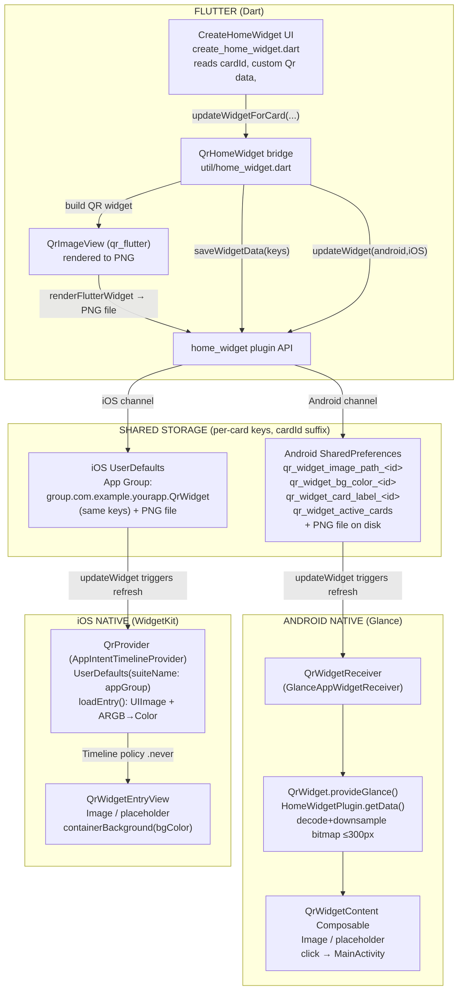

# QR Home Widget Architecture

## Key points

- **Bridge = `home_widget_config.dart`.** Single contract both platforms read.
- **Multi-card scheme:** base keys + `_<cardId>` suffix. `qr_widget_active_cards` = comma list. Both natives fall back to first active card when widget unconfigured.

| Stage | Android | iOS |
|-------|---------|-----|
| Read API | `HomeWidgetPlugin.getData()` → SharedPreferences | `UserDefaults(suiteName: appGroup)` |
| Per-widget card pick | Glance state `widget_card_id` | `SelectCardIntent.card.id` |
| Image | PNG path → `BitmapFactory` downsample ≤300px (binder ~1MB limit) | PNG path → `UIImage(contentsOfFile:)` |
| BG color | Long ARGB → Compose `Color` | Int ARGB → bit-shift → SwiftUI `Color` |
| Refresh | `updateWidget` → `QrWidgetReceiver` | `updateWidget` → reload timeline (`.never` policy) |

- **Data written, not pushed:** Flutter renders PNG + writes metadata, then fires `updateWidget`. Natives pull from shared storage on next render. No live channel — storage is the handoff.
- **Names that must match:** appGroup `group.com.example.yourapp.QrWidget`, android `QrWidgetReceiver`, iOS `QrWidget`, storage key strings (duplicated across all 3 layers — change one, change all).
